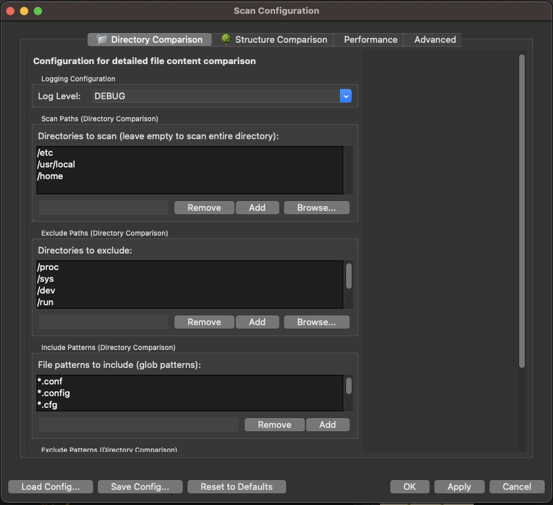

# DriveDiff - Advanced Directory Comparison Tool

A powerful GUI-based application for comparing directories, SD cards, or mounted volumes with intelligent exclusion patterns and dual comparison modes.

## 🚀 Features

### Dual Comparison Modes
- **Directory Comparison**: Deep file-by-file content analysis with SHA256 hash verification
- **Structure Comparison**: Fast directory structure analysis (no file content comparison)
- **Intelligent Path Matching**: Handles mounted volumes (e.g., `/Volumes/rootfs/usr/share` matches `/usr/share`)
- **Separate Configurations**: Independent settings for each comparison type

### Core Analysis
- **SHA256 Hash Verification**: Cryptographic hash-based content comparison
- **Binary File Detection**: Smart detection and handling of binary vs text files
- **File Status Tracking**: Identifies identical, modified, added, and removed files
- **Performance Optimized**: Multi-threaded processing with configurable performance settings

### User Interface
- **Tabbed Interface**: Separate tabs for Directory and Structure comparisons
- **Color-Coded Tree View**: Intuitive hierarchical display with status indicators
  - 🟢 Green: Identical files/directories
  - 🔴 Red: Different or conflicting items
  - 🔵 Blue: Unique items (only in one side)
- **Side-by-Side File Viewer**: Compare file contents with synchronized scrolling
- **Diff Highlighting**: Color-coded text differences
- **Custom Panel Names**: Personalize left/right panel labels
- **Progress Tracking**: Real-time progress for large comparisons

### Advanced Configuration
- **Dual YAML Configuration**: Separate settings for Directory vs Structure comparison
- **Smart Exclusion Patterns**: Built-in patterns for common system directories
- **Mounted Volume Support**: Intelligent handling of mounted filesystems
- **Flexible Path Filtering**: Include/exclude specific paths and patterns
- **Performance Tuning**: Configurable worker threads, hash chunk size, and file limits

### Export & Reporting
- **Multiple Export Formats**: HTML, CSV, JSON, and Text reports
- **Detailed Reports**: Include file sizes, modification times, and panel names
- **Save/Load Comparisons**: Persist comparison results for later analysis
- **Read-Only Protection**: Smart warnings when saving to mounted volumes

## 📸 Screenshots

### Main Application Interface

*The main DriveDiff interface showing the dual-tabbed comparison view with Directory and Structure comparison modes*

### Configuration Dialog

*Comprehensive configuration interface with separate tabs for Directory Comparison, Structure Comparison, Performance, and Advanced settings*

### Directory Comparison Results

*Detailed file-by-file comparison results with color-coded status indicators and tree navigation*

### Structure Comparison View

*Fast directory structure analysis showing hierarchical tree differences*

### File Content Viewer

*Side-by-side file content comparison with diff highlighting and synchronized scrolling*

> **Note**: Screenshots show the application running on macOS. The interface will adapt to your operating system's native styling.

## 📋 Requirements

- **Python**: 3.7 or higher
- **Operating System**: macOS, Windows, or Linux
- **GUI Framework**: tkinter (usually included with Python)
- **Dependencies**: See `requirements.txt`

## 🛠️ Installation

### Option 1: Clone Repository
```bash
git clone https://github.com/yourusername/DriveDiff.git
cd DriveDiff
```

### Option 2: Download ZIP
Download and extract the ZIP file from GitHub

### Install Dependencies
```bash
# Create virtual environment (recommended)
python -m venv .venv
source .venv/bin/activate  # On Windows: .venv\Scripts\activate

# Install required packages
pip install -r requirements.txt
```

## 🚀 Usage

### Quick Start
```bash
# Navigate to project directory
cd DriveDiff

# Activate virtual environment (if using)
source .venv/bin/activate  # On Windows: .venv\Scripts\activate

# Run the application
python src/main.py
```

### Alternative Launch Methods
```bash
# Using the convenience script (Unix/macOS)
./run.sh

# Using the convenience script (Windows)
run.bat
```

### Basic Workflow

DriveDiff features a tabbed interface with specialized views for different types of comparison:

#### Quick Structure Check (Structure Tab)
1. **Select Directories**: Choose left and right directories to compare
2. **Structure Tab**: Click on the "Structure Comparison" tab
3. **Start Analysis**: Click "Compare Structure" for fast directory tree comparison
4. **Navigate Results**: Explore the color-coded hierarchical tree:
   - 🟢 **Green**: Added directories (present in right, missing in left)
   - 🔴 **Red**: Removed directories (present in left, missing in right)  
   - 🔵 **Blue**: Common directories (present in both)
5. **Interactive Navigation**: Expand/collapse directory branches, click directories to select

#### Full Content Comparison (Content Tab)
1. **Select Directories**: Choose left and right directories to compare
2. **Content Tab**: Click on the "Content Comparison" tab (default)
3. **Configure Scan** (Optional): Use "File → Scan Configuration" to set selective paths
4. **Start Comparison**: Click "Compare Directories" for full content analysis
5. **Review Results**: Navigate through identical, modified, added, and removed files
6. **View File Details**: Double-click files to see side-by-side content comparison
7. **Export Reports**: Use "File → Export Report" to save results

## 📁 Project Structure

```
DriveDiff/
├── src/
│   ├── main.py                 # Application entry point
│   ├── core/
│   │   ├── directory_scanner.py    # Directory scanning and comparison logic
│   │   ├── file_comparator.py      # File-level comparison and hashing
│   │   └── report_generator.py     # Export functionality (HTML, CSV, JSON, Text)
│   ├── gui/
│   │   ├── main_window.py          # Main application window
│   │   ├── config_dialog.py        # Configuration dialog interface
│   │   ├── comparison_tree.py      # Tree view for comparison results
│   │   ├── file_viewer.py          # Side-by-side file content viewer
│   │   └── structure_tree.py       # Structure comparison tree view
│   └── utils/
│       ├── yaml_config.py          # YAML configuration management
│       ├── config.py               # Application configuration
│       └── file_utils.py           # File system utilities
├── tests/                      # Test suite
│   ├── integration/            # Integration tests
│   ├── gui/                   # GUI component tests
│   └── *.py                   # Unit tests
├── docs/
│   └── screenshots/           # Application screenshots for documentation
├── requirements.txt           # Python dependencies
├── scan_config.yaml          # Configuration file
├── default.yaml              # Default configuration template
├── .gitignore                # Git ignore patterns
└── README.md                 # This file
```

## ⚙️ Configuration

### Dual Configuration System
DriveDiff uses separate configurations for Directory and Structure comparisons in `scan_config.yaml`:

```yaml
logging:
  level: INFO

directory_comparison:
  paths:
    scan: ["/etc"]           # Directories to scan (empty = scan all)
    exclude: ["/proc", "/sys", "/dev"]  # Directories to exclude
    include: ["*.conf", "*.cfg"]        # File patterns to include
    exclude_patterns: ["*.tmp", "*.log"] # File patterns to exclude

structure_comparison:
  paths:
    scan: []                 # Directories to scan (empty = scan all)
    exclude: ["/proc", "/sys", "/var/cache"]  # Directories to exclude
    exclude_patterns: ["*/tmp/*", "*/cache/*"] # Patterns to exclude

performance:
  worker_threads: 4          # Parallel processing threads
  hash_chunk_size: 65536     # Hash computation chunk size (bytes)
  max_files: 0              # Maximum files to process (0 = unlimited)
```

### Configuration Dialog
Access via "File → Scan Configuration" to configure:

#### 📁 Directory Comparison Tab
- **Scan Paths**: Specific directories to analyze (leave empty to scan all)
- **Exclude Paths**: Directories to skip entirely
- **Include Patterns**: File types to include in comparison
- **Exclude Patterns**: File/directory patterns to ignore

#### 🌳 Structure Comparison Tab  
- **Scan Paths**: Directories for structure analysis
- **Exclude Paths**: Directories to skip in structure comparison
- **Exclude Patterns**: Directory patterns to ignore

#### ⚡ Performance Tab
- **Worker Threads**: Parallel processing configuration
- **Hash Chunk Size**: Memory vs speed optimization
- **Max Files**: Limit for testing large directories

#### 🔧 Advanced Tab
- **Raw YAML Editor**: Direct configuration editing
- **Validation**: Real-time configuration validation
- **Import/Export**: Load/save configuration files

### Intelligent Path Matching
DriveDiff handles mounted volumes intelligently:
- `/Volumes/rootfs/usr/share` matches exclusion pattern `/usr/share`
- Mounted filesystem paths are automatically normalized
- Works across different mount points and operating systems

## 📊 Export Formats

### HTML Reports
- Professional styling with color-coded sections
- Interactive navigation
- Embedded CSS for offline viewing

### CSV Reports
- Spreadsheet-compatible format
- Detailed file information columns
- Easy data analysis

### JSON Reports
- Machine-readable format
- Complete metadata inclusion
- API integration friendly

### Text Reports
- Plain text format
- Console-friendly output
- Simple sharing and viewing

## 🔧 Development

### Running Tests
```bash
# Run test suite
python -m pytest tests/

# Run specific test
python -m pytest tests/test_file_comparator.py
```

### Code Structure
- **Core Logic**: File comparison, hashing, and scanning
- **GUI Components**: Modular interface components
- **Configuration**: YAML-based settings management
- **Utilities**: Helper functions and file operations

## 🐛 Troubleshooting

### Common Issues

**"Read-only file system" error when saving reports**
- Save to your home directory, Desktop, or Documents folder instead of mounted volumes

**Slow comparison on large directories**
- Use scan configuration to exclude unnecessary subdirectories
- Binary files are automatically excluded from content comparison

**Permission errors accessing directories**
- Ensure you have read permissions for both directories
- On macOS, you may need to grant Full Disk Access to Terminal

### Getting Help
1. Check the [Issues](https://github.com/yourusername/DriveDiff/issues) page
2. Review the troubleshooting section above
3. Create a new issue with detailed error information

## 📄 License

This project is licensed under the MIT License - see the [LICENSE](LICENSE) file for details.

## 🤝 Contributing

Contributions are welcome! Please feel free to submit a Pull Request.

1. Fork the repository
2. Create a feature branch (`git checkout -b feature/AmazingFeature`)
3. Commit your changes (`git commit -m 'Add some AmazingFeature'`)
4. Push to the branch (`git push origin feature/AmazingFeature`)
5. Open a Pull Request

## 🙏 Acknowledgments

- Built with Python and tkinter
- SHA256 hashing for reliable file comparison
- YAML configuration for flexible setup
│   ├── core/
│   │   ├── __init__.py
│   │   ├── file_comparator.py    # File comparison logic
│   │   ├── directory_scanner.py  # Directory scanning
│   │   └── report_generator.py   # Report generation
│   ├── gui/
│   │   ├── __init__.py
│   │   ├── main_window.py        # Main application window
│   │   ├── comparison_tree.py    # Tree view component
│   │   ├── file_viewer.py        # File content viewer
│   │   └── dialogs.py            # Various dialogs
│   └── utils/
│       ├── __init__.py
│       ├── file_utils.py         # File system utilities
│       └── config.py             # Configuration management
└── tests/                        # Unit tests
    ├── __init__.py
    ├── test_file_comparator.py
    ├── test_directory_scanner.py
    └── test_file_utils.py
```

## License

This project is licensed under the MIT License.
